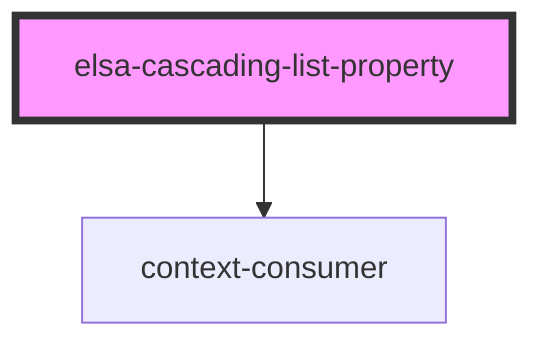

# elsa-check-list-property

<!-- Auto Generated Below -->

## Properties

| Property             | Attribute    | Description | Type                         | Default     |
| -------------------- | ------------ | ----------- | ---------------------------- | ----------- |
| `activityModel`      | --           |             | `ActivityModel`              | `undefined` |
| `propertyDescriptor` | --           |             | `ActivityPropertyDescriptor` | `undefined` |
| `propertyModel`      | --           |             | `ActivityDefinitionProperty` | `undefined` |
| `serverUrl`          | `server-url` |             | `string`                     | `undefined` |

## Dependencies

### Depends on

- context-consumer

### Graph

----------------------------------------------

*Built with [StencilJS](https://stenciljs.com/)*
